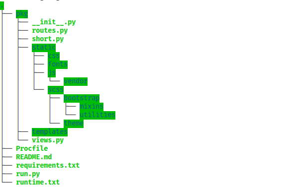

# URL SHORTENER
*A website built with flask for cutting long urls*

## Installation
* First you have to get [Python](https://www.python.org/) installed on your computer.

* Create a new directory
* Open the directory in a terminal, then enter the command `git init .`
* Enter the command `git clone https://github.com/iSOLveIT/URL_SHORTENER.git`

* Install all dependencies in the requirements.txt file by using command `pip install -r requirements.txt`

## How to run the app
#### Using the Flask WSGI_server
* Inorder to run the app, open the directory in a terminal, then enter the command `python3 run.py` 

#### Using the Gunicorn_server
* To run the app, open the directory in a terminal, then enter the command `gunicorn -w 3 -b "127.0.0.1:4000" run:app`

## What does the app achieve?
* The app takes a long URL, e.g."https://doc-10-c4-docs.googleusercontent.com/docs/securesc/6bvugdcb4jfuv6sln121hl421iqubb80/ndcrqch9bf2efd9j8j3rinav1t44il0a/1588270425000/04318508310368253733/04318508310368253733/1PGiyks3g4xdRHHRCIbAsxOAmHFidV0yU?e=view&authuser=0&nonce=4icj51lpfvq5i&user=04318508310368253733&hash=s5830docq4mt34blb3oumnqghl7u38um" and turns it to "https://iscissor.herokuapp.com/mjQv8KFIwH"

## How the app was designed to achieve that?
* The app was designed with the Python web framework called Flask. 
* The app was designed as a package to make the code maintainable.
* The app used the Django MVC architecture by having a different files for holding both the views (views.py) and routes (routes.py in Django known as url.py)

## Directory Structure

## Preview Link
[iSHOrteNER](https://iscissor.herokuapp.com/ishort)

## Author
* __Duodu Randy :octocat:__

### Date Created
* _Monday, 13th October, 2019_

